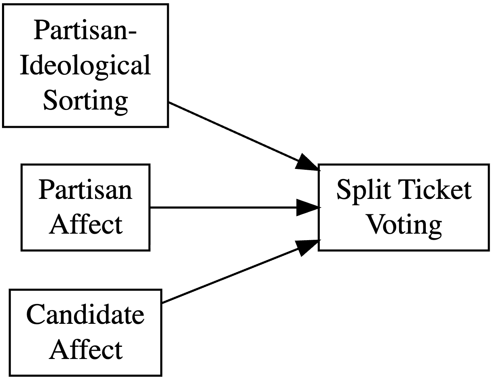

I am currently writing my MA thesis on partisan-ideological sorting [see @Davis2016; @Mason2015], partisan affect, and candidate affect, and split ticket voting in the 2016, 2020, and 2024 elections (see @fig-thesis-theory).

{#fig-thesis-theory fig-align="center" width="45%"}

------------------------------------------------------------------------

During the Specialization phase of my research master program (fall 2025), I explored affective polarization, civic duty, and voter turnout (see @fig-spec-theory). Previous research has looked at affective polarization and voter turnout, and civic duty and voter turnout. My research used the 2020 ANES Time Series Study to look at both affective polarization and civic duty as two predictors of turnout.

I found that the influence of civic duty on turnout varies at different degrees of affective polarization. @fig-pred-probs shows that affective polarization and a (strong) sense of civic duty were associated with greater probabilities of voting, but a strong sense of duty alone was also associated with a greater probability of voting, even when affective polarization was absent or minimal.

{#fig-spec-theory fig-align="center" width="60%"}

{#fig-pred-probs fig-align="center" width="80%"}

::: content-hidden
I am currently researching affective polarization, civic duty, and voter turnout. The literature is inconclusive regarding a (clear) relationship between affective polarization and turnout. Studies of multiparty systems found an association, but studies in the U.S. have not. Separate research has shown that a sense of civic duty can increase someone's chances of voting. I theorize that civic duty may help explain an association between affective polarization and turnout by acting as a moderator. This is represented by the dashed line in @fig-spec-theory; the solid lines indicate what existing literature has studied.

{fig-align="center" width="60%"}

My next research project is my MA thesis, which will look at affective polarization, civic duty, (preference for) straight/split ticket voting, and vote choice.

My research interests include:

-   Affective polarization, also ideological and geographic polarization

-   Public opinion

-   Political behavior

-   State comparative politics

-   California state and local politics

{#fig-state-climate-policies}
:::
